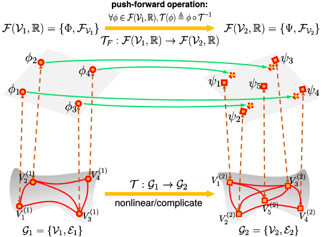

# A Functional Representation for Graph Matching
The implementation of our work [FRGM](http://captain.whu.edu.cn/FRGM/).

This work presents a functional representation for graph matching (FRGM). From the functional representation perspective, the matching between graphs can be reformulated as a linear functional between the function spaces of graphs for general graph matching. Moreover, the linear functional representation map can be viewed as a new parameterization for Euclidean graph matching, which allows us to estimate the geometric parameters and correspondence matrix simultaneously.

<p align="center">

<p>

# Usage
1. The structure are as follows:
```
your_dir/
  -3rd_party[download]()
  -data[download](http://captain.whu.edu.cn/FRGM/data/faceoffs.zip)
  -FRGM-D
  -FRGM-E
  -FRGM-G
  -GM_methods
  -PR_methods


